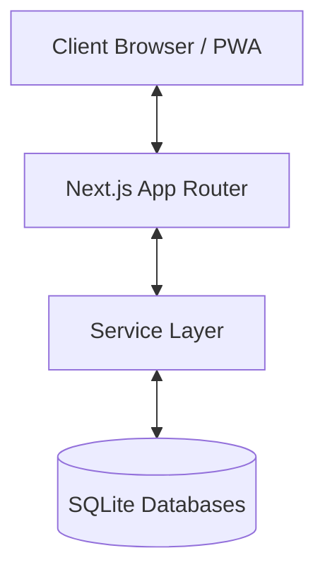

# Architecture - Ting

Ting is designed as a modern, minimalist group expense management application using a service-oriented architecture within the Next.js ecosystem.

## High-Level Design

The application follows a standard **Client-Server** model, but leveraged by Next.js App Router for server-side capabilities.

## Layers

### 1. View Layer (frontend)
- **Framework**: Next.js (App Router, React 19).
- **Styling**: Vanilla CSS with Tailwind utility classes.
- **UI Components**: Shadcn UI (Radix UI) for accessibility and performance.
- **State Management**: 
    - **Zustand**: For persistent UI state (language, current group ID).
    - **React Query**: For server state (fetching expenses, members, reports).

### 2. API Layer
- Located in `src/app/api/`.
- Handles HTTP requests and translates them into service calls.
- Implements async parameter handling for Next.js 15+ compatibility.

### 3. Service Layer (business logic)
- Located in `src/services/`.
- **Pure Logic**: `algorithm.ts` handles the debt-simplification math.
- **Data Services**: `group.service.ts`, `expense.service.ts`, `member.service.ts`, `settlement.service.ts`.
- Encapsulates all domain logic and database interactions.

### 4. Persistence Layer
- **Engine**: SQLite (via `sqlite3` driver).
- **Strategy**: Multi-tenant file-based storage. Each group has its own `.db` file in the `data/` directory for data isolation and easy backups.

## Key Design Patterns
- **Service Pattern**: Decouples business logic from API routes.
- **Master-Detail Storage**: Group metadata is stored separately from group-specific transactions.
- **Persistent State**: LocalStorage-backed Zustand store for seamless redirection and language preference.
