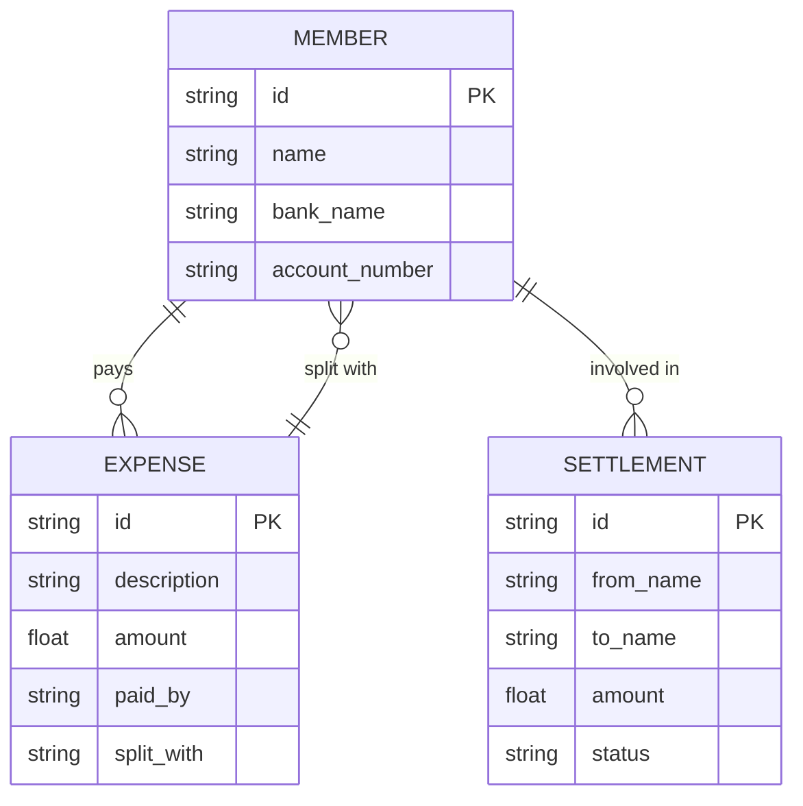

# Database Schema - Ting

Ting uses a multi-tenant SQLite strategy. Each group has its own database file located in the `data/` directory.

## Group Database Schema

### Table: `expenses`
Stores individual expense records.

| Column | Type | Description |
|---|---|---|
| **id** | TEXT | Primary Key (UUID). |
| **description** | TEXT | What the expense was for. |
| **amount** | REAL | Total amount spent. |
| **paid_by** | TEXT | Name of the member who paid. |
| **split_with** | TEXT | JSON string of member names sharing the cost. |
| **created_at** | DATETIME | Timestamp of creation. |

### Table: `members`
Stores group participants and their payment info.

| Column | Type | Description |
|---|---|---|
| **id** | TEXT | Primary Key (UUID). |
| **name** | TEXT | Unique name in the group. |
| **bank_name** | TEXT | Optional: Bank name for payback. |
| **account_name** | TEXT | Optional: Account name for payback. |
| **account_number**| TEXT | Optional: Account number for payback. |
| **qr_code** | TEXT | Optional: Link to payment QR image. |
| **updated_at** | DATETIME | Timestamp of last edit. |

### Table: `settlements`
Persistent tracking of "Mark as Paid" status.

| Column | Type | Description |
|---|---|---|
| **id** | TEXT | Unique string (from_to_amount_hash). |
| **from_name** | TEXT | Debtor name. |
| **to_name** | TEXT | Creditor name. |
| **amount** | REAL | Amount in group currency. |
| **status** | TEXT | 'pending' or 'completed'. |
| **paid_at** | DATETIME | Timestamp of payment confirmation. |

## ERD

