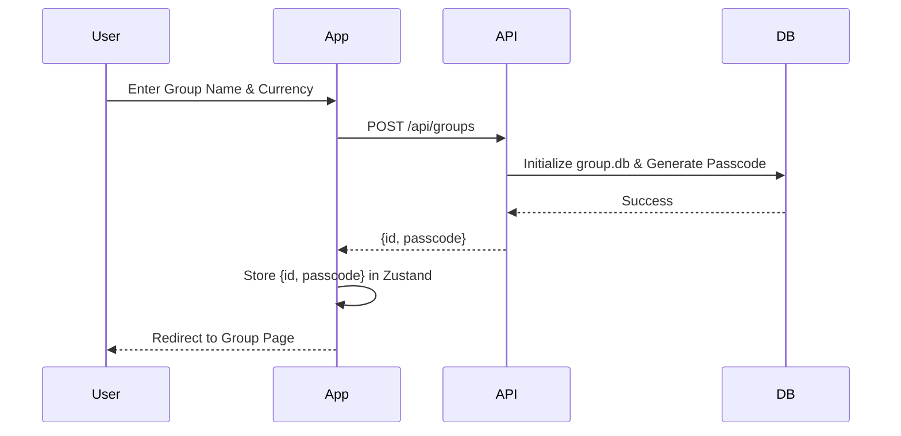
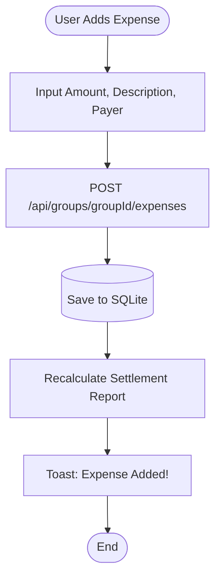
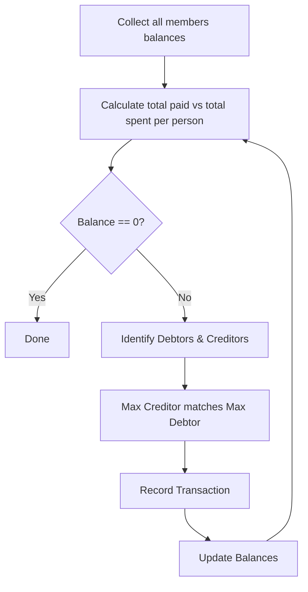
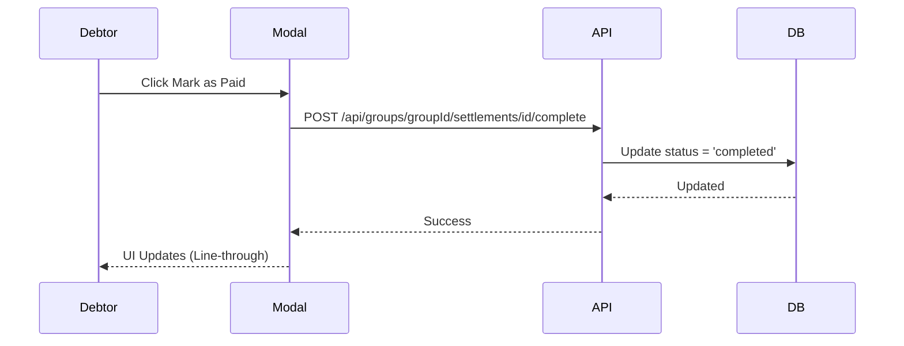

# System Flows - Ting

Visualizing the core business logic flows using Mermaid.js.

## 1. Group Creation & Access

## 2. Expense Lifecycle

## 3. Debt Settlement Algorithm

## 4. Payment Confirmation

